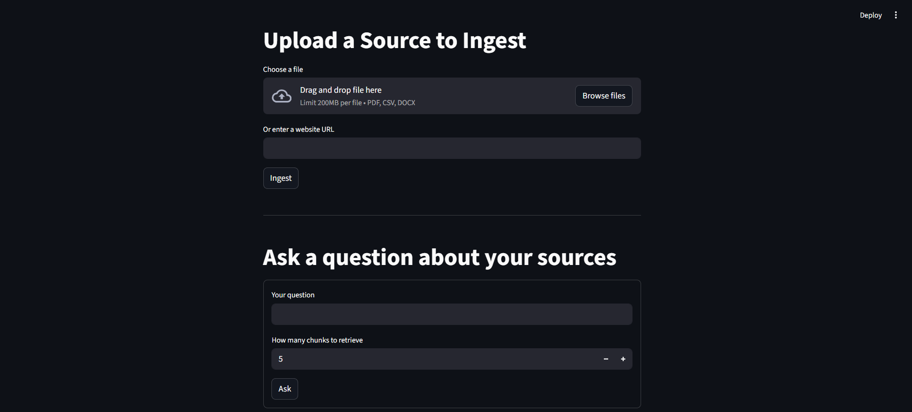
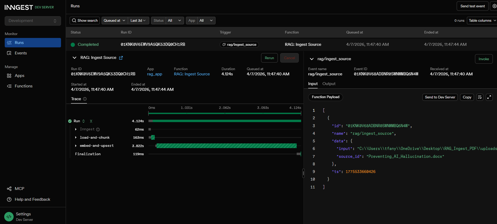
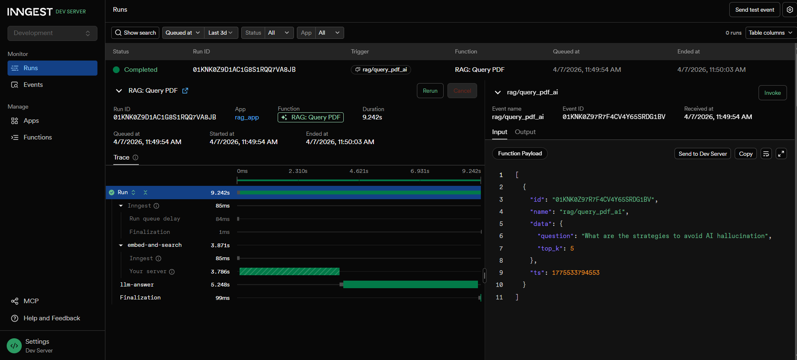
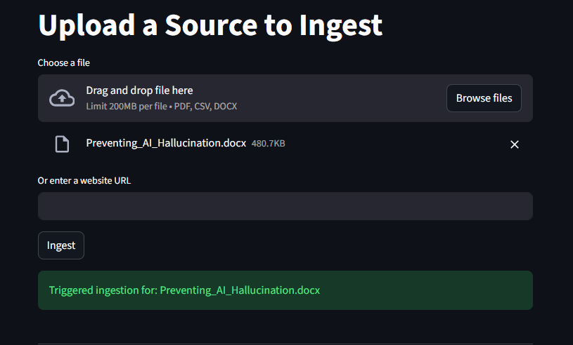
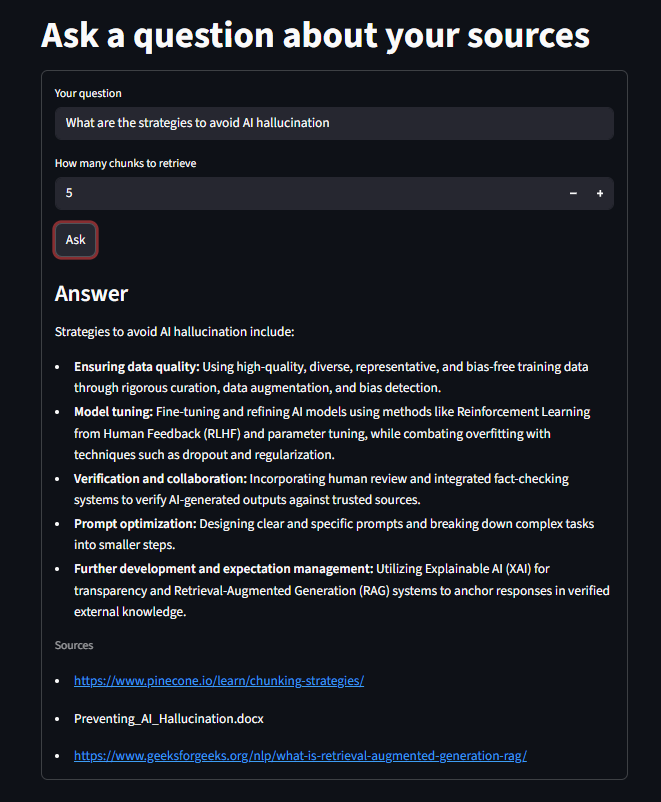

# 🧠 Multi-Source RAG System

## 📌 Overview

This project implements a **Retrieval-Augmented Generation (RAG)** system that enables context-aware question answering across multiple document sources. It combines semantic search with large language models to generate more accurate, relevant, and grounded responses.


---

## ✨ Features

* 📄 Multi-source document ingestion (PDF, Word, Excel, text)
* 🔍 Semantic search using vector embeddings
* 💬 Context-aware Q&A with LLMs
* ⚡ Fast similarity search with Qdrant
* 🖥️ Interactive interface built with Streamlit

---

## 🏗️ Architecture

```
User Input (URL / PDF / CSV / DOCX)
   ↓
Ingestion Pipeline
   ↓
Chunking + Embedding
   ↓
Qdrant Vector Database
   ↓
User Query
   ↓
Embedding Model
   ↓
Vector Search (Qdrant)
   ↓
Top-K Relevant Chunks
   ↓
LLM (with context)
   ↓
Final Answer
```

---

## 🛠️ Tech Stack

* **Frontend:** Streamlit
* **Backend:** Python
* **RAG Framework:** LlamaIndex
* **Embedding Model:** GenAI embeddings (Google API)
* **Vector Database:** Qdrant

---

## 🚀 Setup

### 1. Clone Repository

```bash
git clone https://github.com/your-username/multi-source-rag.git
cd multi-source-rag
```

### 2. Install Dependencies

```bash
pip install -r requirements.txt
```

### 3. Set API Key in .env

```bash
GOOGLE_API_KEY=your_api_key
```

---

### 4. Start Qdrant (Docker Required)

Make sure Docker is running, then:

```bash
docker run -d \
  --name qdrantRagDb \
  -p 6333:6333 \
  -v "$(pwd)/qdrant_storage:/qdrant/storage" \
  qdrant/qdrant
```

---

### 5. Start Backend
Before running the app or Inngest, you must start the backend service:

```bash
uv run uvicorn main:app
```

---

### 6. (Optional) Start Inngest for Monitoring

Inngest is used to monitor ingestion jobs and debug processing status.

```bash
npx inngest-cli@latest dev -u http://127.0.0.1:8000/api/inngest --no-discovery
```
Access the Inngest dashboard to:

- Track ingestion progress  
- Debug failures  
- Observe workflow execution

<p align="center">
  
  
</p>

---

### 7. Run Application

```bash
uv run streamlit run ./streamlit_app.py
```

---

## 💡 Example Use Case

1. Upload documents
<p align="center">
  
</p>

2. Ask questions such as:

> “What are the key insights from this document?”

The system retrieves relevant context and generates a grounded response using retrieved knowledge.

<p align="center">
  
</p>

---

## ⚠️ Notes on Model Usage

This project uses Gemini 2.5 Flash (free tier) for embeddings and/or generation.

* Response speed and output quality may vary due to rate limits and shared infrastructure

* Suitable for prototyping and experimentation

* For production use, a higher-tier model or dedicated API plan is recommended

---

## 🔮 Future Improvements

* Hybrid search (keyword + semantic)
* Support for more data types (images, audio)
* Response evaluation and benchmarking (e.g., RAG metrics)

---
